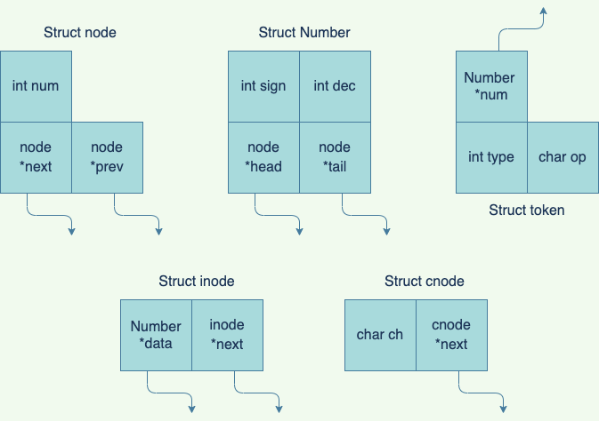
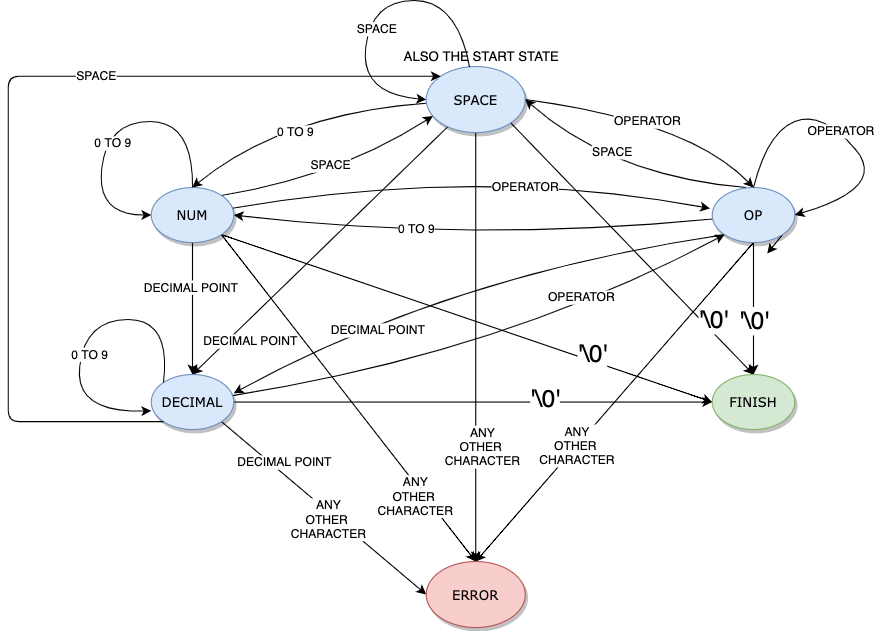
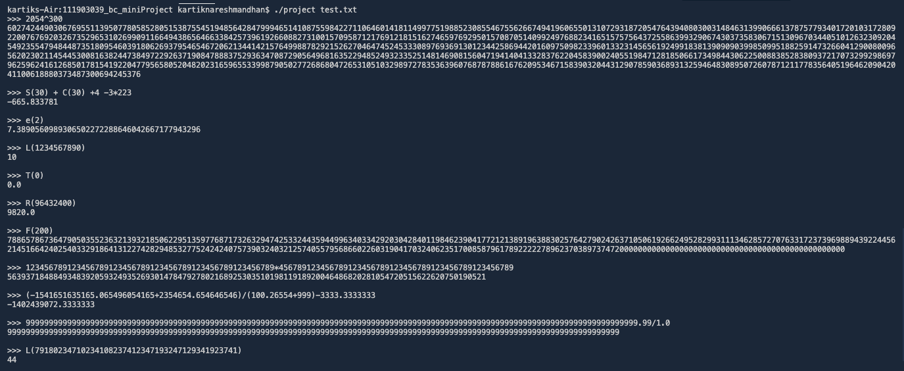
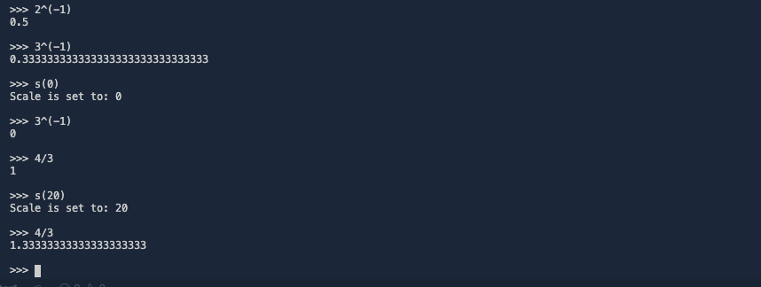

**Project Name:-** Binary Calculator (Infinite Precision Calculator)

### DESCRIPTION :-  

  * This is the **Command line Arbitrary precision calculator** which is implemented using _C Programming language_.
  * It tries to implement some functionalities from unix based command **'bc'**.
  ---
  * Operations performed on countably infinite length numbers are as follows:-
    * Addition
    * Substraction
    * Multiplication
    * Division
    * Modulus  
    * SquareRoot
    * Trignometric Functions like Sine, Cosine, Tangent, input angle is considered in radian units
    * Length of the Number
    * exponential i.e e(x)
    * Factorial of a Number (try 3 digit numbers only) . _Try 1000! on Google calculator it says infinite :)_
  ---
  * All expressions are evaluated according to their **_precedence_**.
  * _paranthesis_ '()' can be used which is having higher precedence.  
  * All the operations performed are stored in  _history.txt_ file, for future reference
  
  
  ---
  
### Execution Instruction :-  

 * Clone the repository on your machine. 
 * Open **Terminal** and _change directory_ to the project directory.  
 * Type command ' **make** ' which will compile the required files and generate _executable file_.   (Linux/Mac recommended)
 * Then type the command ' **./project** '. 
 * Run `./project -h` to get a list of all operations that it can perform
 * `./project <filename>`  will take input from the file and output it on the terminal, example: `./project test.txt`
 * An enter key on empty line exits the program
  ---
  ### DataStructures used :-
**A Doubly Linked List of struct node with Head and tail pointer**
  

**For tokenizing the Input String, I had used Finite State Machine**
  

  
  ## Screenshots of the working Application :-
  
  
  
  **Pull Requests are Welcomed, Giving A Star is appreciated**
